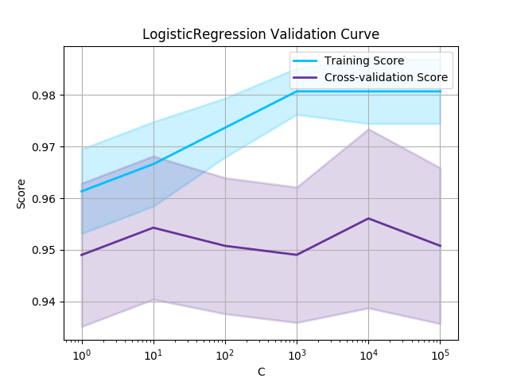

# Clay
A simple plot utils for model validation

Based on [sklearn](https://scikit-learn.org) examples for plotting model validation curves,
making easy to analyse results for models and avoiding boilerplate, mainly on notebooks.

## Installation

 TBD
 
 
## Usage

```python
import numpy as np
from sklearn.datasets import load_breast_cancer
from sklearn.model_selection import validation_curve, learning_curve
from sklearn.linear_model import LogisticRegression
from clay import plot_validation_curve, plot_learning_curve
from matplotlib import pyplot as plt

# dateset
X, y = load_breast_cancer(True)

# base estimator
estimator = LogisticRegression()

# configure plot
plt.grid()
plt.title('{} Learning Curve'.format(type(estimator).__name__))
plt.xlabel("Training Examples")
plt.ylabel("Score")

train_sizes, train_score, test_score = learning_curve(estimator, X, y, cv=5)
plot_learning_curve(train_sizes, train_score, test_score, train_color='deepskyblue', test_color='rebeccapurple')
plt.legend(loc='best')

plt.show()
```

```python
# configure plot
plt.grid()
plt.title('{} Validation Curve'.format(type(estimator).__name__))
plt.xlabel("C")
plt.ylabel("Score")

param_range = [1, 1e1, 1e2, 1e3, 1e4, 1e5]
train_scores, test_scores = validation_curve(estimator, X, y, param_name='max_iter', param_range=param_range)
plot_validation_curve(train_scores, test_scores, param_range, train_color='deepskyblue', test_color='rebeccapurple')
plt.legend(loc='best')

plt.show()
```


----------

Licensed under [BSD 2-Clause](./LICENSE)